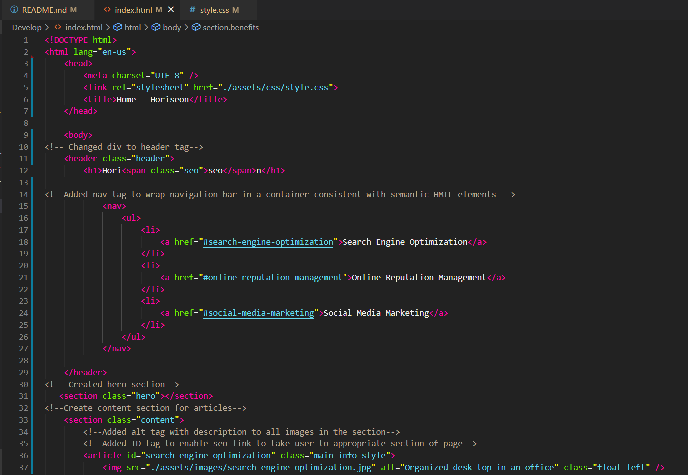

# Code Refactor Read Me
## Provided HTML and CSS for an active website implement best practices such as semantic structure, use of alt tags and effecient structuring of code elemnts according to DRY principles. Code structure and organization is imporant becauase it allows us to effectiely manange a large body of code. It also makes the purpose of each command apparent to other programmers on a project, enabling teams to develop code cooperatively. Lastly, troublshooting is simplified when elements are defined in a logical manner and code with similar functionality is grouped together.  

Example Code Refractor Screenshot

Example Web Page Screenshot

